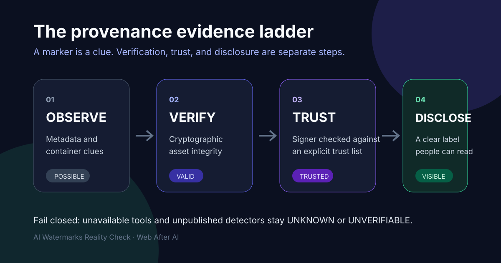

# AI Watermarks Reality Check

Seven portable agent skills for checking what AI provenance evidence exists, whether it verifies, what a publishing pipeline destroys, and what must still be disclosed.



The pack deliberately does **not** remove watermarks or Content Credentials. It makes provenance observable without pretending that one signal can prove authorship.

## Why this exists

Anthropic says newly launched Claude models are gaining imperceptible text watermarks and supported image files can carry signed C2PA metadata. Its public detector and detailed text-watermark specification are not yet available. Meanwhile, common publishing actions—resizing, screenshots, conversion, social uploads—can remove file metadata.

This pack gives teams a reproducible workflow:

```text
inspect → verify → transform-test → privacy-audit → disclosure-check
```

## The seven skills

| Skill | Use it to |
| --- | --- |
| `audit-provenance` | **Start here.** Answer the five questions for one asset in one pass |
| `inspect-content-provenance` | Locate C2PA structure and hidden text channels without overclaiming |
| `verify-content-credentials` | Validate a C2PA manifest and report integrity separately from signer trust |
| `map-provenance-survival` | Compare an original with resized, converted, uploaded, or downloaded derivatives |
| `audit-metadata-privacy` | Inventory GPS, author, device, software, and date metadata without changing the source |
| `check-ai-transparency` | Check whether evidence and human-readable disclosure are ready for review |
| `detect-text-watermark` | Run every available text-provenance detector and report what cannot be checked |

## Install

```bash
npx skills add Neeeophytee/ai-watermarks-reality-check
```

Or copy one directory from `skills/` into your agent's skill directory. Each skill folder is self-contained: the shared parsing core is vendored into every `scripts/` directory, so a single folder works on its own.

### As an MCP server

For agents that cannot run shell commands, all seven skills are exposed as MCP tools:

```json
{
  "mcpServers": {
    "provenance": {
      "command": "python3",
      "args": ["/absolute/path/to/mcp/server.py"]
    }
  }
}
```

The server is **dual-era**: it implements the current stateless revision
`2026-07-28` and still answers the legacy `initialize` handshake used by
`2025-11-25` and earlier clients.

| Behaviour | Support |
| --- | --- |
| `server/discover` (mandatory in 2026-07-28) | Implemented |
| Per-request `_meta["io.modelcontextprotocol/protocolVersion"]` | Honoured |
| `UnsupportedProtocolVersionError` (`-32022`) with `supported`/`requested` | Returned |
| Legacy `initialize` negotiation | Retained |

## Quick start

Every script uses the Python standard library and requires Python 3.9 or newer. Cryptographic C2PA verification additionally requires the official [`c2patool`](https://github.com/contentauth/c2pa-rs/tree/main/cli) **0.20.0 or newer**.

Start with the front door, which answers all five questions in one pass:

```bash
python3 skills/audit-provenance/scripts/audit_provenance.py image.png \
  --c2patool /path/to/c2patool \
  --trust-anchors /path/to/policy.pem
```

The individual analyzers remain directly available:

```bash
python3 skills/inspect-content-provenance/scripts/inspect_file.py image.png

python3 skills/verify-content-credentials/scripts/verify_c2pa.py image.png

python3 skills/map-provenance-survival/scripts/map_survival.py \
  --original original.png \
  --derivative resized=resized.png \
  --derivative social-download=downloaded.jpg

python3 skills/audit-metadata-privacy/scripts/audit_metadata.py image.png

python3 skills/check-ai-transparency/scripts/check_transparency.py \
  examples/transparency-record.json

python3 skills/detect-text-watermark/scripts/detect_text_watermark.py draft.md
```

Scripts emit JSON to stdout and diagnostics to stderr. Remote-manifest fetching is disabled by default and requires `--allow-network`. A missing verifier, an unsupported verifier version, an inaccessible remote manifest, or an unpublished detector produces an explicit unknown state rather than a pass.

## Evidence model

| Dimension | States | Meaning |
| --- | --- | --- |
| Manifest presence | `PRESENT`, `POSSIBLE`, `ABSENT`, `UNKNOWN` | Whether a C2PA manifest is observed |
| Integrity | `VALID`, `INVALID`, `NOT_VERIFIED`, `UNKNOWN` | Whether a conforming verifier validated the claim |
| Signer trust | `TRUSTED`, `UNTRUSTED`, `NOT_CHECKED`, `UNKNOWN` | Whether the signing chain reaches the selected trust list |
| Text watermark | `UNVERIFIABLE` | Anthropic has not published its detector as of 2026-08-13 |

`POSSIBLE` means a structural carrier, sidecar, or format-appropriate malformed
hint was located; inspect the marker confidence before acting. Only
`STRUCTURAL` means the location and carrier form match the specification.
`PRESENT` is only ever returned by a conforming verifier. `ABSENT` is emitted
only for a completed bounded scan of a supported container or an explicit live
verifier "no claim" result. `VALID` never automatically means `TRUSTED`.
Absence of a mark never proves that content was human-made.

A literal mention of "C2PA" in readable text is recorded in `c2pa_mentions` and is never evidence.

### C2PA carriers checked

Detection is structural, at the locations the C2PA 2.4 specification defines.

| Container | Carrier | `ABSENT` possible? |
| --- | --- | --- |
| PNG | `caBX` chunk | yes |
| JPEG | APP11 JUMBF segment | yes |
| WebP | RIFF `C2PA` chunk | yes |
| TIFF/DNG | private tag `0xCD41`, type 7, in the last main IFD | yes |
| GIF | `C2PA_GIF` application extension | yes |
| HTML | head `<script type="application/c2pa">` containing Base64; `<link rel="c2pa-manifest">` | yes |
| Text | A.8 variation-selector wrapper; A.9 block in host comments or front matter | yes |
| PDF | Associated File `/AFRelationship /C2PA_Manifest` | **no** |
| BMFF (MP4/HEIC/AVIF) | `uuid` box with the C2PA UUID, or `jumb` | **no** |
| OOXML / ODF / ZIP | packaged manifest entry | **no** |
| Any | detached `.c2pa` sidecar | — |

**Fail closed.** The right-hand column is the important one. For formats marked
**no**, this build inspects the carriers listed but cannot walk the container
exhaustively — compressed PDF object streams and fragmented BMFF are the reasons
— so finding nothing yields `UNKNOWN` with a stated reason, never `ABSENT`.

| Confidence | Meaning |
| --- | --- |
| `STRUCTURAL` | Found at a spec-defined location |
| `MODERATE` | A format-appropriate key or XML namespace reference |
| `SIDECAR` | A detached `.c2pa` manifest beside the asset |

## Partial scans

A bounded read can never produce a conclusive clean result. `detect-text-watermark`
streams the whole file where practical and always reports:

| Field | Meaning |
| --- | --- |
| `file_sha256` | SHA-256 over **every byte on disk**, always |
| `scanned_sha256` | SHA-256 over the region actually analysed |
| `file_bytes` / `scanned_bytes` | sizes of each |
| `scan_complete` | whether the two coincide |

If `scan_complete` is false, the status is `INCONCLUSIVE` with a reason and exit
`2`, even when nothing suspicious was seen in the part that was read. A prefix
hash is never presented as the file hash.

## Exit-code contract

Every entrypoint uses the same convention, so an orchestrating agent can apply one rule:

| Code | Meaning |
| --- | --- |
| `0` | Conclusive and good — verified valid, no required gaps, no risk found |
| `1` | Conclusive and bad — invalid, required gaps, HIGH privacy risk, provenance lost, covert channel found |
| `2` | Inconclusive — unknown state, missing or unsupported verifier, unsupported container |

## Output schemas

Machine-readable JSON Schemas for all seven tools live in [`schemas/`](schemas). Every branch of every tool returns the same top-level field set, and CI validates real outputs against these schemas. The schemas also encode the evidence invariants: a document claiming `integrity: VALID` with `manifest_presence: ABSENT` fails validation.

## Text watermark detection

`detect-text-watermark` runs a detector registry and reports honestly per adapter:

| Adapter | Runs? | State when it cannot run |
| --- | --- | --- |
| `anthropic-official` | never | `UNVERIFIABLE` — no public detector or specification exists |
| `synthid-text` | never in this build | `NOT_CONFIGURED` without keys, `UNSUPPORTED` with them |
| `kgw-research` | never in this build | `NOT_CONFIGURED` without a key, `UNSUPPORTED` with one |
| `unicode-covert-channel` | **yes** | — |
| `c2pa-text-manifest` | **yes** | — |

The state vocabulary distinguishes five situations, so a caller can never mistake
"did not look" for "looked and found nothing":

| State | Meaning |
| --- | --- |
| `DETECTED` | The detector ran and found the signal |
| `NOT_DETECTED` | The detector ran and did not find it |
| `NOT_CONFIGURED` | Required keys or config were not supplied; nothing was analysed |
| `UNSUPPORTED` | Configured, but this build ships no scorer; nothing was analysed |
| `UNVERIFIABLE` | The scheme cannot be checked by a third party at all |
| `FAILED` | The detector errored |

**Only `DETECTED` and `NOT_DETECTED` mean a detector ran**, and only those
contribute to the top-level status. `SynthID` and `KGW` accept configuration but
this build performs **no scoring** for either — they are unavailable
integrations, not silent passes.

Keyed model-level watermarks bias token sampling with a secret key; detection requires that key. A third party cannot check them, and this pack says so rather than guessing.

A standards-compliant C2PA text manifest (2.4 §A.8) is itself a run of variation
selectors after a ZWNBSP. It is recognised as provenance and **excluded** from
covert-channel findings rather than reported as suspicious.

The covert-channel scan finds Unicode tag characters (ASCII smuggling), bidi overrides, variation selectors, zero-width characters, exotic spaces, and mixed-script homoglyphs. These are **text-integrity and prompt-injection signals**, not watermark evidence: they identify no model or vendor.

**Deliberate non-goal:** statistical or stylometric AI-text classifiers are not implemented and will not be added. Their false-positive rates make them unsafe for accusing a person of AI authorship.

## Development

```bash
python3 tests/make_fixtures.py
python3 -m unittest discover -s tests -v
python3 scripts/check_repo.py
python3 scripts/sync_shared.py --check
```

To exercise the cryptographic trust path against a certificate this repository
creates, rather than a vendor sample:

```bash
python3 tests/make_signed_fixture.py --c2patool /path/to/c2patool
```

It generates an ES256 chain, signs a fixture, and writes a tampered copy into
`tests/fixtures/signed/` (gitignored — no key is ever committed). Six otherwise
skipped tests then verify `VALID`, `TRUSTED` against our own anchor, and
`INVALID` after tampering. Exits `3` and skips if signing is unavailable.

`shared/provenance_core.py` is the source of truth for all container parsing. It is vendored into each skill by `scripts/sync_shared.py`; CI fails if the copies drift.

CI runs the suite on Python 3.9–3.13, regenerates every fixture, drives the MCP
server over stdio, and runs a dedicated job that downloads a
**checksum-pinned** `c2patool` release and fails if the live verification or
self-signed trust tests are skipped.

The six self-signed tests skip locally when the generated signing fixture is not
present; the dedicated CI job requires them to execute. Python 3.9–3.13 remain
part of the hosted matrix.

For a local live smoke test:

```bash
python3 scripts/live_c2pa_smoke.py \
  --c2patool /path/to/c2patool \
  --signed /path/to/sample/C.jpg \
  --unsigned /path/to/sample/image.jpg \
  --trust-anchors /path/to/sample/trust_anchors.pem
```

The smoke test also creates a temporary tampered derivative and requires it to be rejected.
Pass `--tampered /path/to/known-tampered.jpg` when a fixture already contains a
deliberate mutation in content covered by the manifest's hard binding.

## Scope and safety

- No watermark removal, evasion, or provenance stripping.
- No source files are modified.
- No authorship verdicts.
- No legal-compliance claims.
- No statistical AI-text detection.
- Reports avoid printing sensitive metadata values by default.

## Sources

See [SOURCES.md](SOURCES.md). Product behavior is volatile; the source review date is recorded there.

## License

MIT
